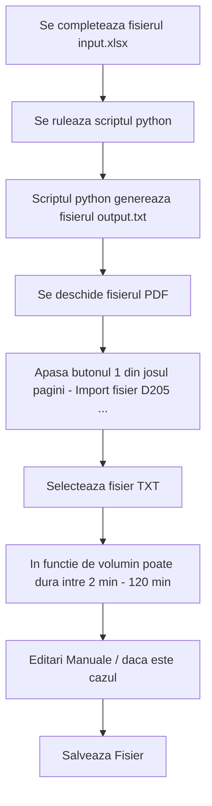

# Generare fisier TXT pentru import PDF D205 ANAF Romania
Generare txt pentru Formularul D205 – Declaratie privind impozitul retinut la sursa pentru dividende, bacsis, premii si alte venituri, disponibil in format „PDF inteligent”

## Cuprins
- [Scop](#scop)
- [Fisiere Git](#fisiere)
- [Dependente](#dependente)
- [Cum se foloseste](#cum-se-foloseste)
- [Rulare script](#rulare-script)
- [Erori Cunoscute / Sfaturi](#erori-eunoscute-si-sfaturi)

## Scop
Scopul proiectului este a converti un fisier de tip Excel intr-un format de tip Txt care poate fi importat in PDF-ul inteligent ANAF D205_XML_2024_120225.pdf pentru completarea raportului sau generare fisierului XML

## Fisiere 

- generareTXT.py : fisierul prin care se genereza txt-ul
- input.xlsx : fisierul in care se pun datele
- output.txt : fisierul care se importa in PDF-ul Inteligent
- temp_D205.. : PDF-ul Inteligent (!!Atentie!! acesta se poate schimba in functie de an, verifica site-ul ANAF)

## Dependente

- python instalat v3.10 sau mai mare
- instalare librari python
    - import os
    - import pandas as pd
    ```txt
    pip install pandas
    ```


### Cum se foloseste


### Rulare script 
Pentru a executa / rula scriptul:
```
python generareTXT.py
```

### Structura fisier txt
https://static.anaf.ro/static/10/Anaf/Declaratii_R/AplicatiiDec/structura_D205_2024_110225.pdf

Exemplu fisier:
```txt
205,12,2024,#0#,#NUMEADMINISTRATOR#,#PRENUMEADMINISTRATOR#,#ADMINISTRATOR#,11223344,#NUME SOCIETATE SRL#,#JUDET  LOCALITATE  STR TESTSTRADA  NR 1 AP 1
12,#TESTNUME TESTPRENUME1#,1,##,6010111011011,##,2,,,127,13,##
29,#TESTNUME TESTPRENUME2#,1,##,2220222222200,##,2,,,85960,12712,##
18,#TESTNUME TESTPRENUME3#,2,##,1110122222200,##,2,,,65,22,##
```

### Erori Cunoscute Si Sfaturi

- Importul fisierului TXT in PDF are un timp mare de procesare cand se depasesc 100 de coloane si poate da impresia ca fisierul PDF s-a blocat cu toate acestea el lucreaza iar importul va fi dus la bun sfarsit. Ex: pentru 1500 de randuri timp de asteptare 45 de minute.  
